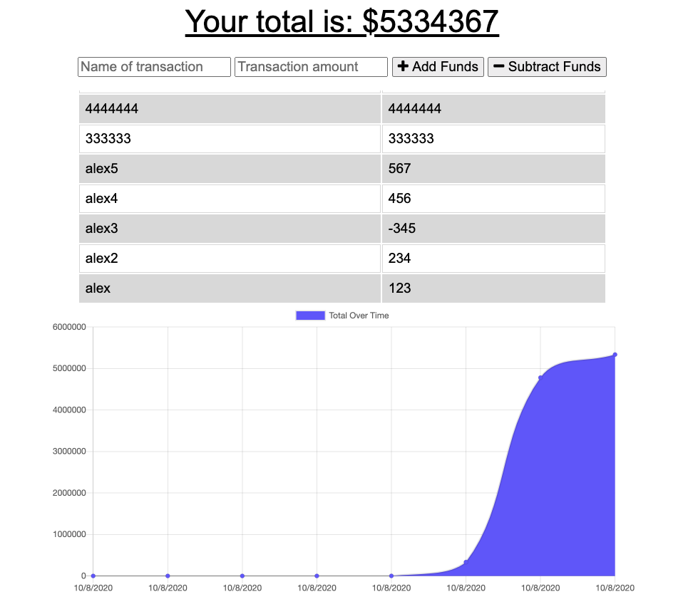

# Budget Tracker
1. [ Description. ](#desc)
2. [ Questions.](#ques)
3. [ Screenshot.](#scrsh)

## Description:
### Giving users a fast and easy way to track their money is important, but allowing them to access that information at any time is even more important. Having offline functionality is paramount to the success of an application that handles users’ financial information.

## Questions:
### My gitHub profile:
## https://github.com/Alex2055
### Email me:
## alexfromnashville@gmail.com

 #
 

    